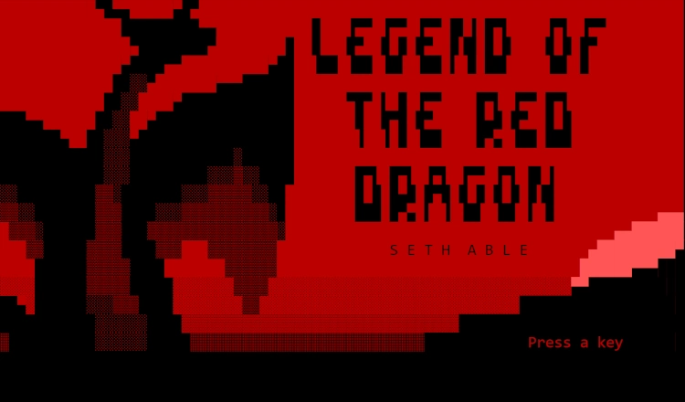

# Legend Of the Red Dragon  
{: .homeh1 } 
{: .mt-5 }
  
  
Legend Of the Red Dragon is a BBS 'Door' Game which became very popular in the early internet stages at the 90s. To be fair, it was a popular role-playing online game before the internet even existed (or was open).  

Dial up BBS's were the public's main connection to the online world with message forums, ANSI art galleries, downloadable files, and of course, games.  
  
This wiki focuses on the modern browser-based version of LoRD hosted on Gearhost, which is a successor to the NuKlear LoRD version.  
  
