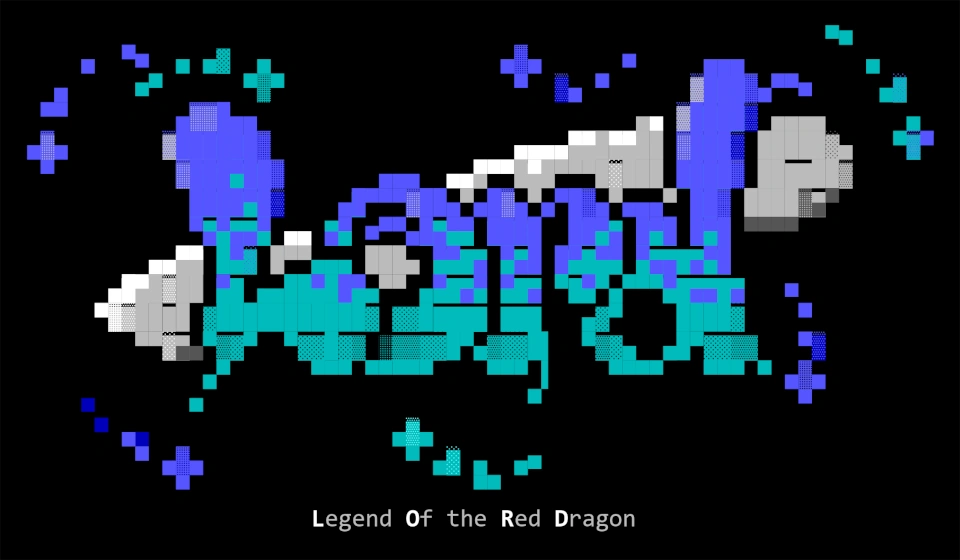

### Legend of Red Dragon (LoRD)

Legend of the Red Dragon is a text based role-playing game which was popular in the 1990s on BBS systems. Before the Internet was well known, dial-up BBS's were the public's main connection to the online world with message forums, ANSI art galleries, downloadable files, and of course, games. 

